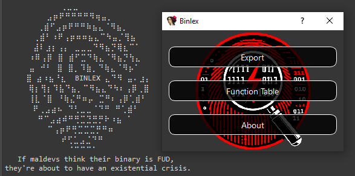

[](https://github.com/c3rb3ru5d3d53c/binlex/stargazers)
[](https://discord.gg/UDBfRpxV3B)
[](https://github.com/c3rb3ru5d3d53c/binlex/blob/master/LICENSE)


<table>
  <tr>
    <td style="border: none; text-align: center; vertical-align: middle;">
      
    </td>
    <td style="border: none; text-align: center; vertical-align: middle; padding-left: 10px;">
      <h1 style="font-weight: bold; margin: 0;">Binlex - A Binary Genetic Trait Lexer Framework</h1>
      <div style="font-size: smaller; font-weight: bold; margin-top: 5px;">
        If maldevs think their binary is FUD, they're about to have an existential crisis.
      </div>
    </td>
  </tr>
</table>

**Binlex** is a tool for malware analysts and researchers that extracts **instructions**, **basic blocks**, and **functions** from binary files and organizes them into a structured hierarchy of **genomes**, **chromosomes**, **allele pairs**, and **genes**. 🦠🔍

- A **genome** represents an **instruction**, **block**, or **function** in the binary. 🧬
- Each genome contains one or more **chromosomes**, which are **patterns** or **sequences** of data within the instruction, function, or block.
- A **chromosome** is made up of **allele pairs**, each representing **two genes**, encoded as a **single byte** (split into two **nibbles**).
- A **gene** is the smallest unit, represented by a **single nibble**.

This hierarchical breakdown allows **binlex** to analyze and compare malware binaries by treating their code structure like a "DNA fingerprint," making it easier to detect patterns, similarities, and variations across samples.

Unlike tools relying on **pure Python**, which can be slow 🐢, Binlex is designed for speed, simplicity, and flexibility. Its **command-line interface** helps analysts search for patterns across **hundreds or thousands of malware samples**, saving **time** ⏳ and **resources** 💰.

For malware analysts and reverse engineers, **binlex** includes a IDA plugin and a vector database (**binlex** server) designed to identify similar functions.

While tools like **BinDiff** and **Diaphora** excel in single-file comparisons, **binlex** server operates more like **Lumina** but with a modern approach. Instead of relying on FLIRT signatures, **binlex** server leverages the power of a **Graph Neural Network (GNN)** and similarity hashing with architecture specific normalization for enhanced precision and flexibility.

With **binlex** sever, you gain access to usernames, timestamps, and the sample hashes from which function signatures are derived, critical insights for collaborative analysis.

A set of command-line tools are also provided to malware analysts and reverse engineers to help speed up the hunting of common patterns for threat hunting and detection.

For developers, **binlex** offers a **Rust API** and **Python bindings** to build custom tooling with minimal licensing restrictions. 🔓

As part of the fight against malware, **binlex** is free to use—just **download the binaries** from the release page. 📥

## 🚀 Features

The latest version of **binlex** provides the following amazing features!

| Feature                         | Description                                                                                     |
|---------------------------------|-------------------------------------------------------------------------------------------------|
| 🌐 **Platforms**   | - Windows 🪟<br>- MacOS 🍏<br>- Linux 🐧                                                    |
| 🌐 **Formats**   | - PE <br>- MachO <br>- ELF                                                  |
| 🌐 **Architectures**   | - AMD64 <br>- I386<br> - CIL                                               |
| 🧵 **Multi-Threading**          | - 🔒 Thread-Safe Disassembler Queuing<br>- 🚄 Multi-Threaded Tooling for Maximum Efficiency      |
| ⚙️ **Customizable Performance** | Toggle features on/off to optimize for your use case                                           |
| 📉 **JSON String Compression**  | Save memory with JSON compression                                                    |
| 🧩 **Similarity Hashing**       | - 🔍 Minhash<br>- 🔒 TLSH<br>- 🔐 SHA256                                                        |
| 🧩 **Function Symbols**         | - Pass function symbols to **binlex** as standard input using **blpdb**, **blelfsym** or **blmachosym** or your own tooling                        |
| 🏷️ **Tagging**                  | Tagging for easy organization                                                                  |
| 🎯 **Wildcarding** | Perfect for generating YARA rules and now at a resolution of nibbles!                                                     |
| **API** | - 🦀 Rust API<br>-Python API                                                         |
| 🤖 **Machine Learning Features** | - 📊 Normalized Features<br>- 🔍 Vector Database<br>- 📚 Jupyter Notebook<br>- 🧠 Function Identification |
| 📂 **Virtual Imaging** | - Efficient mapping cache for virtual images<br>- 🗄️ Compatible with ZFS / BTRFS<br>- Speeds up repetitive tasks and filtering<br>- Lightening speed ⚡ |

By caching virtual images, **binlex** is able to perform at better speeds, making repeat runs faster and more efficient.

## Building

To build **binlex** you need Rust.

### Linux, MacOS and Windows

Installation is straight foward on Linux and MacOS.

```bash
cargo build --release
```

### Python Bindings
```bash
cd src/bindings/python/
virtualenv -p python3 venv/
source venv/bin/activate
pip install maturin[patchelf]
maturin develop
python
>> import binlex
```

### Packaging

To build packages for various platforms use the `Makefile`.

```bash
make zst   # Make Arch Linux Package
make deb   # Make Debian Package
make wheel # Make Python Wheel
```

The resulting packages will be in the `target/` directory.

### IDA Plugin

Installing the IDA plugin is easy to install, just make sure you installed the Python bindings in the Python environment for IDA.

Now copy the directory for the **binlex** plugin to your plugin directory.

```bash
mkdir -p ~/.idapro/plugins/
cp -r scripts/plugins/ida/binlex/ ~/.idapro/plugins/
cd ~/.idaapro/plugins/binlex/
pip install -r requirements.txt
```

You will also need to ensure the server is running, GPU hardware is recommended for faster GNN inference but not required.

```bash
cd scripts/blserver/
make -C configs/
docker-compose up -d
```

Once completed the following services will be available.


| **Service Name**             | **Description**                             | **URL**                                 |
|------------------------------|---------------------------------------------|-----------------------------------------|
| Binlex Server                | API Documentation                           | `https://127.0.0.1/swagger`             |
| Attu Milvus Vector Database  | Attu Milvus Vector Database UI              | `https://127.0.0.1:8443`                |
| MinIO                        | MinIO Object Store                          | `https://127.0.0.1:7443`                |
| JupyterHub                   | JupyterHub Web GUI                          | `https://127.0.0.1:6443`                |


The default API key is `39248239c8ed937d6333a41874f1c8e310c5070703af30c06e67b0d308cb82c5`, which you can use with your IDA plugin.

Once you open IDA, you should be greeted with the **binlex** welcome message.

<p align="center">
  
</p>

Using the IDA plugin you have various features that are provided to help you with YARA rule writing and similarity analysis.

**Main Menu:**
- Export Database (Export to JSON)
- Index Database
- Search Database (Search and Apply Function Names)
- Functions (Functions Table)
- Export Byte Color Map (Save Byte ColorMap to SVG)
- JSON Query (jq queries inside IDA)

**Disassembler Context Menu:**
- Copy YARA Pattern
- Copy Hex
- Copy MinHash from Selection
- Copy TLSH from Selection
- Scan for MinHash
- Scan for TLSH

Once you set your API key and URL, it is saved in the IDA registry and auto-completed for you in the future.

The copy pattern and copy hex feature is intended to help with YARA rules and the copying of similarity hashes and scanning is for hunting for similar data.

To ensure your database can be accessed by others using the same server click `Index Database`, which pushes the function data to the server.

To find function names, click `Search Database`, which will populate a table once completed of best matches from the vector databaase you can then apply to your project.

### Documentation

```bash
cargo doc
```

You can also open the docs.

```bash
cargo doc --open
```

## Binary Genomes, Chromosomes, Allele Pairs and Genes

In **binlex**, a hierarchy of genetic-inspired terms is used to describe and symbolize the structure and traits of binary code. This terminology reflects the relationships between different abstractions and their genetic analogies:

- **Genome**: Represents the each object being analyzed, such as a function or block. It encapsulates all the information, including metadata, chromosomes, and other attributes.

- **Chromosome**: Represents the core patterns or sequences extracted from a block or function. A chromosome acts as the blueprint for identifying key characteristics of the binary without memory addressing as indicated by wildcards like `?`, where a single wildcard represents a single gene.

- **AllelePair**: A unit within the chromosome consisting of **two genes**. Allele pairs are the building blocks of the chromosome, combining genes into meaningful pairs.

- **Gene**: The smallest unit of genetic information, representing a single nibble of data (half a byte).

The relationship between these abstractions can be visualized as follows:

```text
Genome (function / block)
 └── Chromosome (pattern / sequence)
      └── AllelePair (two genes / single byte / two nibbles)
           └── Gene (single nibble)
```

### Genome Example

```JSON
{
  "type": "block",
  "architecture": "amd64",
  "address": 6442934577,
  "next": null,
  "to": [],
  "edges": 0,
  "prologue": false,
  "conditional": false,
  "chromosome": {
    "pattern": "4c8b47??498bc0",
    "feature": [4,12,8,11,4,7,4,9,8,11,12,0],
    "entropy": 2.2516291673878226,
    "sha256": "1f227bf409b0d9fbc576e747de70139a48e42edec60a18fe1e6efdacb598f551",
    "minhash": "09b8b1ad1142924519f601854444c6c904a3063942cda4da445721dd0703f290208f3e32451bf5d52741e381a13f12f9142b5de21828a00b2cf90cf77948aac4138443c60bf77ec31199247042694ebb2e4e14a41369eddc7d9f84351be34bcf61458425383a03a55f80cbad420bb6e638550c15876fd0c6208da7b50816847e62d72b2c13a896f4849aa6a36188be1d4a5333865eab570e3939fab1359cbd16758f36fa290164d0259f83c07333df535b2e38f148298db255ac05612cae04d60bb0dd810a91b80a7df9615381e9dc242969dd052691d044287ac2992f9092fa0a75d970100d48362f62b58f7f1d9ec594babdf52f58180c30f4cfca142e76bf",
    "tlsh": null
  },
  "size": 7,
  "bytes": "4c8b4708498bc0",
  "functions": {},
  "number_of_instructions": 3,
  "entropy": 2.5216406363433186,
  "sha256": "84d4485bfd833565fdf41be46c1a499c859f0a5f04c8c99ea9c34404729fd999",
  "minhash": "20c995de6a15c8a524fa7e325a6e42b217b636ab03b00812732f877f4739eeee41d7dde92ceac73525e541f9091d8dc928f6425b84a6f44b3f01d17912ec6e8c6f913a760229f685088d2528447e40c768c06d680afe63cb219a1b77a097f679122804dd5a1b9d990aa2579e75f8ef201eeb20d5650da5660efa3a281983a37f28004f9f2a57af8f81728c7d1b02949609c7ad5a30125ff836d8cc3106f2531f306e679a11cabf992556802a3cb2a75a7fe3773e37e3d5ab107a23bf22754aee15a5f41056859b06120f86cb5d39071425855ec90628687741aa0402030d73e04bc60adb0bd2430560442c4309ae258517fc1605438c95485ac4c8621026a1bb",
  "tlsh": null,
  "contiguous": true,
  "attributes": [
    {
      "type": "tag",
      "value": "corpus:malware"
    },
    {
      "type": "tag",
      "value": "malware:lummastealer"
    },
    {
      "entropy": 6.55061550644311,
      "sha256": "ec1426109420445df8e9799ac21a4c13364dc12229fb16197e428803bece1140",
      "size": 725696,
      "tlsh": "T17AF48C12AF990595E9BBC23DD1974637FAB2B445232047CF426489BD0E1BBE4B73E381",
      "type": "file"
    }
  ]
}
```

Given this JSON genome example.
- **Genome**: The JSON object describing the block, including its metadata, chromosome, and attributes.
- **Chromosome**: as described by the pattern `"4c8b47??498bc0"`
- **AllelePair**: `"4c"` or `"8b"`
- **Gene**: `"4"` or `"c"`

Using the **binlex** API it is possible to mutate these chromosomes, their allele pairs and genes to facilitate genetic programming.

Genetic programming in this context can have several benifits including but not limited to:
- Hunting for novel samples given a dataset
- YARA rule generation

## Command-Line

The simplest way to get started is with the command-line, leveraging a JSON filtering tool like `jq`.

The following command disassembles `sample.dll` with `16` threads, the relevant traits are JSON objects, one per line and are piped into `jq` for filtering and beautifying.

To see what options are available when using the **binlex** command-line use `-h` or `--help`.

```bash
A Binary Pattern Lexer

Version: 2.0.0

Usage: binlex [OPTIONS] --input <INPUT>

Options:
  -i, --input <INPUT>
  -o, --output <OUTPUT>
  -a, --architecture <ARCHITECTURE>      [amd64, i386, cil]
  -c, --config <CONFIG>
  -t, --threads <THREADS>
      --tags <TAGS>
      --minimal
  -d, --debug
      --enable-instructions
      --enable-block-instructions
      --disable-hashing
      --disable-disassembler-sweep
      --disable-heuristics
      --enable-mmap-cache
      --mmap-directory <MMAP_DIRECTORY>
  -h, --help                             Print help
  -V, --version                          Print version

Author: @c3rb3ru5d3d53c
```

A simple example of using the command-line is provided below.

```bash
binlex -i sample.dll --threads 16 | jq
```

Please note that **binlex** will detect the file format fort you and currently supports `PE`, `ELF` and `MACHO` binary formats.

### Configuration

Upon your first execution of **binlex** it will store the configuration file in your configuration directory in `binlex/binlex.toml`.

This **binlex** finds the default configuration directory based on your operating system as indicated in the table below for its configuration.

| OS       | Environment Variable                  | Example Binlex Configuration Path                              |
|----------|---------------------------------------|----------------------------------------------------------------|
| Linux    | `$XDG_CONFIG_HOME` or `$HOME/.config` | `/home/alice/.config/binlex/binlex.toml`                       |
| macOS    | `$HOME/Library/Application Support`   | `/Users/Alice/Library/Application Support/binlex/binlex.toml`  |
| Windows  | `{FOLDERID_RoamingAppData}`           | `C:\Users\Alice\AppData\Roaming\binlex\binlex.toml`            |

The default configuration name `binlex.toml` for **binlex** is provided below.

```toml
[general]
threads = 16
minimal = false
debug = false

[formats.file.hashing.sha256]
enabled = true

[formats.file.hashing.tlsh]
enabled = true
minimum_byte_size = 50
threshold = 200

[formats.file.hashing.minhash]
enabled = true
number_of_hashes = 64
shingle_size = 4
maximum_byte_size_enabled = false
maximum_byte_size = 50
seed = 0
threshold = 0.75

[formats.file.heuristics.features]
enabled = true

[formats.file.heuristics.entropy]
enabled = true

[instructions]
enabled = false

[instructions.hashing.sha256]
enabled = true

[instructions.hashing.tlsh]
enabled = true
minimum_byte_size = 50
threshold = 200

[instructions.hashing.minhash]
enabled = true
number_of_hashes = 64
shingle_size = 4
maximum_byte_size_enabled = false
maximum_byte_size = 50
seed = 0
threshold = 0.75

[instructions.heuristics.features]
enabled = true

[instructions.heuristics.entropy]
enabled = true

[blocks]
enabled = true

[blocks.instructions]
enabled = false

[blocks.hashing.sha256]
enabled = true

[blocks.hashing.tlsh]
enabled = true
minimum_byte_size = 50
threshold = 200

[blocks.hashing.minhash]
enabled = true
number_of_hashes = 64
shingle_size = 4
maximum_byte_size_enabled = false
maximum_byte_size = 50
seed = 0
threshold = 0.75

[blocks.heuristics.features]
enabled = true

[blocks.heuristics.entropy]
enabled = true

[functions]
enabled = true

[functions.blocks]
enabled = true

[functions.hashing.sha256]
enabled = true

[functions.hashing.tlsh]
enabled = true
minimum_byte_size = 50
threshold = 200

[functions.hashing.minhash]
enabled = true
number_of_hashes = 64
shingle_size = 4
maximum_byte_size_enabled = false
maximum_byte_size = 50
seed = 0
threshold = 0.75

[functions.heuristics.features]
enabled = true

[functions.heuristics.entropy]
enabled = true

[chromosomes.hashing.sha256]
enabled = true

[chromosomes.hashing.tlsh]
enabled = true
minimum_byte_size = 50
threshold = 200

[chromosomes.hashing.minhash]
enabled = true
number_of_hashes = 64
shingle_size = 4
maximum_byte_size_enabled = false
maximum_byte_size = 50
seed = 0
threshold = 0.75

[chromosomes.heuristics.features]
enabled = true

[chromosomes.heuristics.entropy]
enabled = true

[chromosomes.homologues]
enabled = true
maximum = 4

[mmap]
directory = "/tmp/binlex"

[mmap.cache]
enabled = false

[disassembler.sweep]
enabled = true
```

If the command-line options are not enough the configuration file provides the most granular control of all options.

If you wish to override the default configuration file and specify another configuration file use the command-line parameter.

```bash
binlex -c config.toml -i sample.dll
```

When you run **binlex**, it uses the configuration file and overrides any settings when the respective command-line parameter is used.

### Making a YARA Rule

Here is a general workflow getting started with making YARA rules, where we get 10 unique wildcarded YARA hex strings from a given sample.

```bash
binlex -i sample.dll --threads 16 | jq -r 'select(.size >= 16 and .size <= 32 and .chromosome.pattern != null) | .chromosome.pattern' | sort | uniq | head -10
016b??8b4b??8bc74c6bd858433b4c0b2c0f83c5??????
01835404????c6836a0400????837e04??
03c04c8d05????????4863c8420fb60401460fb64401018942??85c074??
03c38bf0488d140033c9ff15????????488bd84885c075??
03c6488d55??41ffc58945a?41b804000000418bcce8b8fd01??eb??
03c6488d55??41ffc58945a?41b804000000418bcce8e3fb01??eb??
03f7488d05????????4883c310483bd87c??
03fb4c8bc6498bd7498bcc448d0c7d04000000e89409????8bd84885f6
03fe448bc6488bd3418bcee8d8e501??85ed
03fe897c24??397c24??0f867301????
```

To take this a step further you can run it through the `blyara` tool to make a quick YARA signature.

```bash
binlex -i sample.dll --threads 16 | jq -r 'select(.size >= 16 and .size <= 32 and .chromosome.pattern != null) | .chromosome.pattern' | sort | uniq | head -10 | blyara -n example
rule example {
    strings:
        $trait_0 = {016b??8b4b??8bc74c6bd858433b4c0b2c0f83c5??????}
        $trait_1 = {01835404????c6836a0400????837e04??}
        $trait_2 = {03c04c8d05????????4863c8420fb60401460fb64401018942??85c074??}
        $trait_3 = {03c38bf0488d140033c9ff15????????488bd84885c075??}
        $trait_4 = {03c6488d55??41ffc58945a?41b804000000418bcce8b8fd01??eb??}
        $trait_5 = {03c6488d55??41ffc58945a?41b804000000418bcce8e3fb01??eb??}
        $trait_6 = {03f7488d05????????4883c310483bd87c??}
        $trait_7 = {03fb4c8bc6498bd7498bcc448d0c7d04000000e89409????8bd84885f6}
        $trait_8 = {03fe448bc6488bd3418bcee8d8e501??85ed}
        $trait_9 = {03fe897c24??397c24??0f867301????}
    condition:
        1 of them
```

For even better results if you exported the **genomes** using the **binlex** IDA plugin or by other means you can filter for function starting prefixes like `mw::`, for `malware`, which is pretty common.

```bash
cat dump.json | jq -r 'select(.type == "function" and .size > 32 and (.attributes[] | .type == "symbol" and (.name | startswith("mw::")))) | .blocks[] | select(.size > 32) | .chromosome.pattern' | blyara -n example
```

### Using Ghidra with Binlex

To use **binlex** with ghidra use the `blghidra/blghidra.py` script in the scripts directory.

To leverage function names and virtual addresses from your `Ghidra` projects and provide them to **binlex** use the `analyzeHeadless` script in your `Ghidra` install directory.

```bash
./analyzeHeadless \
  <project-directory> \
  <project-name> \
  -process sample.dll \
  -noanalysis \
  -postscript blghidra.py 2>/dev/null |  grep -P "^{\"type" | binlex -i sample.dll
```

Please note that `analyzeHeadless` prints log messages to `stdout` and other log output to `stderr` that is of no use interoperability with other command-line utilities.

As such, to collect the output of the script it must be filtered with `2>/dev/null |  grep -P "^{\"type"`.

### Using Rizin with Binlex

To leverage the power of Rizin function detection and function naming in **binlex**, run `rizin` on your project using `aflj` to list the functions in JSON format.

Then pipe this output to `blrizin`, which parses `rizin` JSON to a format **binlex** undestands.

Additionally, you can combine this with other tools like `blpdb` to parse PDB symbols to get function addresses and names.

You can then do any parsing as you generally would using `jq`, in this example we count the functions processed by **binlex** to see if we are detecting more of them.

```bash
rizin -c 'aaa;aflj;' -q sample.dll | \
  blrizin | \
  blpdb -i sample.pdb | \
  binlex -i sample.dll | \
  jq 'select(.type == "function") | .address' | wc -l
```

**NOTE**: At this time `blrizin` is also compatiable with the output from `radare2` using `blrizin`.

### Collecting Machine Learning Features

If you are would like to do some machine learning, you can get features representing the nibbles without memory addressing from binlex like this.

```bash
binlex -i sample.dll --threads 16 | jq -r -c 'select(.size >= 16 and .size <= 32 and .signature.feature != null)| .signature.feature' | head -10
[4,9,8,11,12,0,4,1,11,9,0,3,0,0,1,15,0,0,4,5,3,3,12,0,8,5,13,2,4,8,8,11,13,0,4,1,0,15,9,5,12,0,4,8,15,15,2,5]
[4,4,8,11,5,1,4,5,3,3,12,0,3,3,12,0,4,8,8,3,12,1,3,0,4,1,0,15,10,3,12,2]
[4,8,8,3,14,12,4,12,8,11,12,10,4,4,8,9,4,4,2,4,11,2,0,1,4,4,0,15,11,7,12,1,8,10,12,10,14,8,5,11,4,8,8,3,12,4,12,3]
[4,8,8,3,14,12,4,4,8,9,4,4,2,4,4,12,8,11,12,10,4,4,0,15,11,7,12,1,11,2,0,1,3,3,12,9,14,8,0,11,4,8,8,3,12,4,12,3]
[4,0,5,3,4,8,8,3,14,12,15,15,1,5,8,11,12,8,8,11,13,8,15,15,1,5,8,11,12,3,4,8,8,3,12,4,5,11,12,3]
[11,9,2,0,0,3,15,14,7,15,4,8,8,11,8,11,0,4,2,5,4,8,0,15,10,15,12,1,4,8,12,1,14,8,1,8,12,3]
[8,11,0,12,2,5,11,8,2,0,0,3,15,14,7,15,4,8,12,1,14,1,2,0,4,8,8,11,4,8,12,1,14,0,0,8,4,8,15,7,14,1,4,8,8,11,12,2,12,3]
[4,8,8,11,0,5,4,8,8,5,12,0,7,5,12,3,4,8,15,15,2,5]
[4,8,8,11,0,13,3,3,12,0,3,8,8,1,11,0,0,8,0,15,9,5,12,0,12,3]
[4,8,8,11,0,5,4,8,8,5,12,0,7,5,12,3,4,8,15,15,2,5]
```

If you would like to refine this for your machine learning model by normalizing them between 0 and 1 float values binlex has you covered with the `blscaler` tool.

```bash
binlex -i sample.dll --threads 16 | jq -r -c 'select(.size >= 16 and .size <= 32 and .signature.feature != null)' | blscaler --threads 16 | jq -c -r '.signature.feature' | head -1
[0.26666666666666666,0.6,0.5333333333333333,0.7333333333333333,0.8,0.0,0.26666666666666666,0.06666666666666667,0.7333333333333333,0.6,0.0,0.2,0.0,0.0,0.06666666666666667,1.0,0.0,0.0,0.26666666666666666,0.3333333333333333,0.2,0.2,0.8,0.0,0.5333333333333333,0.3333333333333333,0.8666666666666667,0.13333333333333333,0.26666666666666666,0.5333333333333333,0.5333333333333333,0.7333333333333333,0.8666666666666667,0.0,0.26666666666666666,0.06666666666666667,0.0,1.0,0.6,0.3333333333333333,0.8,0.0,0.26666666666666666,0.5333333333333333,1.0,1.0,0.13333333333333333,0.3333333333333333]
```

### Virtual Image File Mapping Cache with Compression
To leverage the powerful feature of filemapping to reduce memory usage but still benifit from virtual images.

```bash
# Install BTRFS
sudo pacman -S btrfs-progs compsize
# Enable the Kernel Module on Boot
echo "btrfs" | sudo tee /etc/modules-load.d/btrfs.conf
# Reboot
reboot
# Create Virtual Image Cache Storage Pool
dd if=/dev/zero of=btrfs.img bs=1M count=2048
# Make it BTRFS
mkfs.btrfs btrfs.img
# Make a Cache Directory in /tmp/
mkdir -p /tmp/binlex/
# Mount the Cache (Multiple Compression Options Available)
sudo mount -o compress=lzo btrfs.img /tmp/binlex/
# Run Binlex
binlex -i sample.dll --threads 16 --enable-file-mapping --file-mapping-directory /tmp/binlex/ --enable-file-mapping-cache
sudo compsize ec1426109420445df8e9799ac21a4c13364dc12229fb16197e428803bece1140
# Virtual Image 6GB vs Stored Size of 192MB
# Processed 1 file, 49156 regular extents (49156 refs), 0 inline.
# Type       Perc     Disk Usage   Uncompressed Referenced
# TOTAL        3%      192M         6.0G         6.0G
# none       100%      384K         384K         384K
# lzo          3%      192M         6.0G         6.0G
```

This can set this up to be on disk or if `/tmp/` directory is mapped to RAM.

When mapped to RAM, we are taking advantage of virtual image disassembling but without the additional RAM penalty where repetitive tasks almost double in processing speed.

Since `btrfs` abstracts the access to the mapped file in kernel we are able to access it as we would any mapped file but with the benefit of compression.

To save yourself time if you choose this option, make the mounting of the `btrfs` pool happen on boot and have your **binlex** configuration file set to prefer virtual image caching in the mounted pool directory. This approach ensures that you need not rely on the command-line parameters each time.

## Binlex API

The philophsy of the **binlex** project is focused on security, simplicity, speed and extendability.

Part of this is providing an API for developers to write their own detection and hunting logic.

At this time, **binlex** provides both Rust and Python bindings.

### Rust API

The Rust, API makes is easy to get started

#### Native PE

```rs
use std::process;
use binlex::Config;
use binlex::formats::PE;
use binlex::disassemblers::capstone::Disassembler;
use binlex::controlflow::Graph;

// Get Default Configuration
let mut config = Config();

// Use 16 Threads for Multi-Threaded Operations
config.general.threads = 16;

// Read PE File
let pe = PE.new("./sample.dll", config)
  .unwrap_or_else(|error| {
    eprintln!("{}", error);
    process::exit(1);
  });

// To check if DotNet PE use pe.is_dotnet()

// Get Memory Mapped File
let mapped_file = pe.image()
  .unwrap_or_else(|error| {
    eprintln!("{}", error);
    process::exit(1)
  });

// Get Mapped File Virtual Image
let image = mapped_file
  .mmap()
  .unwrap_or_else(|error| {
    eprintln!("{}", error);
    process::exit(1);
  });

// Create Disassembler
let disassembler = Disassembler(pe.architecture(), &image, pe.executable_virtual_address_ranges(), config)
  .unwrap_or_else(|error| {
    eprintln!("{}", error);
    process::exit(1);
  });

// Create Control Flow Graph
let cfg = Graph(pe.architecture(), config);

// Disassemble Control Flow
disassembler.disassemble_controlflow(pe.entrypoint_virtual_addresses(), &mut cfg);
```

#### .NET (MSIL/CIL) PE

```rs
use std::process;
use binlex::Config;
use binlex::formats::PE;
use binlex::disassemblers::custom::cil::Disassembler;
use binlex::controlflow::Graph;

// Get Default Configuration
let mut config = Config();

// Use 16 Threads for Multi-Threaded Operations
config.general.threads = 16;

// Read PE File
let pe = PE.new("./sample.exe", config)
  .unwrap_or_else(|error| {
    eprintln!("{}", error);
    process::exit(1);
  });

// To check if DotNet PE use pe.is_dotnet()

// Get Memory Mapped File
let mapped_file = pe.image()
  .unwrap_or_else(|error| {
    eprintln!("{}", error);
    process::exit(1)
  });

// Get Mapped File Virtual Image
let image = mapped_file
  .mmap()
  .unwrap_or_else(|error| {
    eprintln!("{}", error);
    process::exit(1);
  });

// Create Disassembler
let disassembler = Disassembler(pe.architecture(), &image, pe.dotnet_metadata_token_virtual_addresses(), pe.dotnet_executable_virtual_address_ranges(), config)
  .unwrap_or_else(|error| {
    eprintln!("{}", error);
    process::exit(1);
  });

// Create Control Flow Graph
let cfg = Graph(pe.architecture(), config);

// Disassemble Control Flow
disassembler.disassemble_controlflow(pe.dotnet_entrypoint_virtual_addresses(), &mut cfg);
```

#### ELF

```rs
use std::process;
use binlex::Config;
use binlex::formats::ELF;
use binlex::disassemblers::custom::cil::Disassembler;
use binlex::controlflow::Graph;

// Get Default Configuration
let mut config = Config();

// Use 16 Threads for Multi-Threaded Operations
config.general.threads = 16;

// Read PE File
let elf = ELF.new("./sample.exe", config)
  .unwrap_or_else(|error| {
    eprintln!("{}", error);
    process::exit(1);
  });

// Get Memory Mapped File
let mapped_file = elf.image()
  .unwrap_or_else(|error| {
    eprintln!("{}", error);
    process::exit(1)
  });

// Get Mapped File Virtual Image
let image = mapped_file
  .mmap()
  .unwrap_or_else(|error| {
    eprintln!("{}", error);
    process::exit(1);
  });

// Create Disassembler
let disassembler = Disassembler(elf.architecture(), &image, elf.executable_virtual_address_ranges(), config)
  .unwrap_or_else(|error| {
    eprintln!("{}", error);
    process::exit(1);
  });

// Create Control Flow Graph
let cfg = Graph(elf.architecture(), config);

// Disassemble Control Flow
disassembler.disassemble_controlflow(elf.entrypoint_virtual_addresses(), &mut cfg);
```

#### MACHO

```rs
use std::process;
use binlex::Config;
use binlex::formats::MACHO;
use binlex::disassemblers::custom::cil::Disassembler;
use binlex::controlflow::Graph;

// Get Default Configuration
let mut config = Config();

// Use 16 Threads for Multi-Threaded Operations
config.general.threads = 16;

// Read PE File
let macho = MACHO.new("./sample.app", config)
  .unwrap_or_else(|error| {
    eprintln!("{}", error);
    process::exit(1);
  });

// Iterate the MACHO Fat Binary Slices
for index in macho.number_of_slices() {
  // Get Memory Mapped File
  let mapped_file = macho.image(index)
    .unwrap_or_else(|error| {
      eprintln!("{}", error);
      process::exit(1)
    });

  // Get Mapped File Virtual Image
  let image = mapped_file
    .mmap()
    .unwrap_or_else(|error| {
      eprintln!("{}", error);
      process::exit(1);
    });

  // Create Disassembler
  let disassembler = Disassembler(macho.architecture(index), &image, macho.executable_virtual_address_ranges(index), config)
    .unwrap_or_else(|error| {
      eprintln!("{}", error);
      process::exit(1);
    });

  // Create Control Flow Graph
  let cfg = Graph(macho.architecture(index), config);

  // Disassemble Control Flow
  disassembler.disassemble_controlflow(macho.entrypoints(index), &mut cfg);
}

```

#### Accessing Genetic Traits

```rs
use binlex::controlflow::Instruction;
use binlex::controlflow::Block;
use binlex::controlflow::Function;

for address in cfg.instructions.valid_addresses() {
  // Read Instruction from Control Flow
  instruction = Instruction(address, &cfg);

  // Print Instruction from Control Flow
  instruction.print();
}

for address in cfg.blocks.valid_addresses() {
  // Read Block from Control Flow
  block = Block(address, &cfg);

  // Print Block from Control Flow
  block.print();
}

for address in cfg.functions.valid_addresses() {
  // Read Function from Control Flow
  function = Function(address, &cfg);

  // Print Function from Control Flow
  function.print();
}
```

### Python API

The binlex Python API is now designed to abstract the disassembler and the controlflow graph.

To disassemble a PE memory mapped image use the following examples.

There are more examples in the `examples/python/` directory.

#### Native PE

```python
from binlex.formats import PE
from binlex.disassemblers.capstone import Disassembler
from binlex.controlflow import Graph
from binlex import Config

# Get Default Configuration
config = Config()

# Use 16 Threads for Multi-Threaded Operations
config.general.threads = 16

# Open the PE File
pe = PE('./sample.exe', config)

# To check if a DotNet PE use ps.is_dotnet()

# Get the Memory Mapped File
mapped_file = pe.image()

# Get the Memory Map
image = mapped_file.mmap()

# Create Disassembler on Mapped PE Image and PE Architecture
disassembler = Disassembler(pe.architecture(), image, pe.executable_virtual_address_ranges(), config)

# Create the Controlflow Graph
cfg = Graph(pe.architecture(), config)

# Disassemble the PE Image Entrypoints Recursively
disassembler.disassemble_controlflow(pe.entrypoint_virtual_addresses(), cfg)
```

#### .NET (MSIL/CIL) PE
```python
from binlex.formats import PE
from binlex.disassemblers.custom.cil import Disassembler
from binlex.controlflow import Graph
from binlex import Config


# Get Default Configuration
config = Config()

# Use 16 Threads for Multi-Threaded Operations
config.general.threads = 16

# Open the PE File
pe = PE('./sample.exe', config)

# To check if a DotNet PE use ps.is_dotnet()

# Get the Memory Mapped File
mapped_file = pe.image()

# Get the Memory Map
image = mapped_file.mmap()

# Create Disassembler on Mapped PE Image and PE Architecture
disassembler = Disassembler(pe.architecture(), image, pe.dotnet_metadata_token_virtual_addresses(), pe.dotnet_executable_virtual_address_ranges(), config)

# Create the Controlflow Graph
cfg = Graph(pe.architecture(), config)

# Disassemble the PE Image Entrypoints Recursively
disassembler.disassemble_controlflow(pe.dotnet_entrypoint_virtual_addresses(), cfg)
```

#### ELF

```python
from binlex.formats import ELF
from binlex.disassemblers.capstone import Disassembler
from binlex.controlflow import Graph
from binlex import Config

# Get Default Configuration
config = Config()

# Use 16 Threads for Multi-Threaded Operations
config.general.threads = 16

# Open the ELF File
elf = ELF('./sample.so', config)

# Get the Memory Mapped File
mapped_file = pe.image()

# Get the Memory Map
image = mapped_file.mmap()

# Create Disassembler on Mapped ELF Image and ELF Architecture
disassembler = Disassembler(elf.architecture(), image, elf.executable_virtual_address_ranges(), config)

# Create the Controlflow Graph
cfg = Graph(elf.architecture(), config)

# Disassemble the PE Image Entrypoints Recursively
disassembler.disassemble_controlflow(elf.entrypoint_virtual_addresses(), cfg)
```

#### MACHO

```python
from binlex.formats import MACHO
from binlex.disassemblers.capstone import Disassembler
from binlex.controlflow import Graph
from binlex import Config

# Get Default Configuration
config = Config()

# Use 16 Threads for Multi-Threaded Operations
config.general.threads = 16

# Open the ELF File
macho = MACHO('./sample.app', config)

# MachO Fat Binary Can Support Multiple Architectures
for index in macho.number_of_slices():

  # Get the Memory Mapped File
  mapped_file = macho.image(index)

  # Get the Memory Map
  image = mapped_file.mmap()

  # Create Disassembler on Mapped MACHO Image and MACHO Architecture
  disassembler = Disassembler(macho.architecture(index), image, macho.executable_virtual_address_ranges(index), config)

  # Create the Controlflow Graph
  cfg = Graph(macho.architecture(index), config)

  # Disassemble the MACHO Image Entrypoints Recursively
  disassembler.disassemble_controlflow(macho.entrypoints(index), cfg)
```

#### Parsing the Controlflow Graph

Sometimes it maybe nessassary to parse the controlflow graph generated.

In this case, you can use the following technique.

```python
from binlex.controlflow import Instruction
from binlex.controlflow import Block
from binlex.controlflow import Function

# Iterate Valid Instructions
for address in cfg.queue_instructions.valid_addresses():
  # Read Instruction from Control Flow
  instruction = Instruction(address, cfg)
  # Print Instruction from Control Flow
  instruction.print()

# Iterate Valid Blocks
for address in cfg.queue_blocks.valid_addresses():
  # Read Block from Control Flow
  block = Block(address, cfg)
  # Print Block from Control Flow
  block.print()

# Iterate Valid Functions
for address in cfg.queue_functions.valid_addresses():
  # Read Function from Control Flow
  function = Function(address, cfg)
  # Print Function from Control Flow
  function.print()
```

#### Iterating Controlflow Instructions, Blocks, and Functions

Instead of parsing you can access the instructions, blocks, and functions more directly.

```python
for instruction in cfg.instructions():
  instruction.print()

for block in cfg.blocks():
  block.print()

for function in cfg.functions():
  function.print()
```

#### Iterating from Functions to Instructions

It is also possible to iterate from functions to blocks, to instructions, to allele pairs, to genes.

This represents going from the highest level abstraction to the lowest abstraction.

```python
for function in cfg.functions():
    for block in function.blocks():
        for instruction in block.instructions():
            for allelepair in instruction.chromosome().allelepairs():
                for gene in allelepair.genes():
                    print(gene)
```

#### Comparing Function Similarity

One of the most powerful tools you can use in **binlex** is to compare functions, blocks, and instructions using similarity hashing.

To perform these comparisons is as simple as calling the `compare` method.

```python
for lhs in lhs_cfg.functions():
  for rhs in rhs_cfg.functions():
    similarity = lhs.compare(rhs)
    similarity.print()

for lhs in lhs_cfg.blocks():
  for rhs in rhs_cfg.blocks():
    similarity = lhs.compare(rhs)
    similarity.print()

for lhs in lhs_cfg.instructions():
  for rhs in rhs_cfg.instructions():
    similarity = lhs.compare(rhs)
    similarity.print()
```

Any supported similarity hashing algorithms will be calcualted if they are enabled with your configuration.

Although it can be challenging, **binlex** supports performing similarity analysis on non-contiguous functions using its own algorithm to find the best similarity matches.

At least 75% or more of a non-contiguous function's data must be hashable to yield a similarity hash.

#### Accessing Genetic Properties

Each instruction, block and function or **genome** has an associated chromosome which can be accessed via the API.

You can follow these abstractions down to allele pairs, and their respective genes.

```python
# Iterate Block Chromosome
chromosome = block.chromosome()
for allelepair in chromosome.allelepairs():
  for gene in allelepair.genes()
    gene.print()

# Iterate Block Chromosome
chromosome = function.chromosome()
for allelepair in chromosome.allelepairs():
  for gene in allelepair.genes()
    gene.print()

# Iterate Block Chromosome
chromosome = function.chromosome()
for allelepair in chromosome.allelepairs():
  for gene in allelepair.genes()
    gene.print()
```

#### Performing Genetic Mutations

If you are looking to perform genetic programming tasks you can also mutate chromosomes, allelepairs, and genes and they keep track of their own number of mutations.

```python
chromosome = block.chromosome()
chromosome.mutate('deadbe?f')
chromosome.number_of_mutations()
chromosome.print()

for allelepair in chromosome.allelepairs():
  allelepair.mutate('dead')
  allelepair.number_of_mutations()
  allelepair.print()
  for gene in allelepair.genes():
    gene.mutate('d')
    gene.number_of_mutations()
    gene.print()
```

This facilitates mutations with genetic algorithms you may with to employ for your usecases.

## Citation

If you are using **binlex** in a journal publication, or an open-source AI model use the following citation.

```bibtex
@misc{binlex,
  author = {c3rb3ru5d3d53c},
  title = {binlex: A Binary Genetic Trait Lexer Framework},
  year = {2025},
  note = {Available at \url{https://github.com/c3rb3ru5d3d53c/binlex}}
}
```

If the use of **binlex** is for corporate, personal purposes, or for generating outputs that are not open-source AI models, no citation is needed.

For example, if you use **binlex** to create YARA rules, no citation is needed.

This ensures that **binlex** stays relevant but also ensures permissive corporate and personal use.
