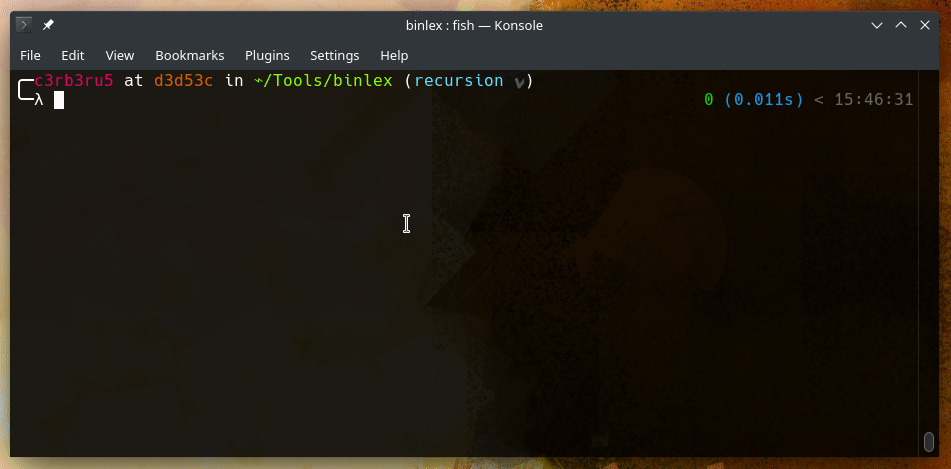

# binlex

<h2>A Genetic Binary Trait Lexer Library and Utility</h2>

The purpose of `binlex` is to extract basic blocks and functions as traits from binaries for malware research, hunting and detection.

Most projects attempting this use Python to generate traits, but it is very slow.

The design philosophy behind `binlex` is it to keep it simple and extendable.

The simple command-line interface allows malware researchers and analysts to hunt traits across hundreds or thousands of potentially similar malware saving time and money in production environments.

While the C++ API allows developers to get creative with their own detection solutions, completely unencumbered by license limitations.

To help combat malware, we firmly commit our work to the public domain for the greater good of the world.

[](https://ci.appveyor.com/project/c3rb3ru5d3d53c/binlex)


[](https://github.com/c3rb3ru5d3d53c/binlex/stargazers)
[](https://github.com/c3rb3ru5d3d53c/binlex/network)
[](https://discord.gg/UDBfRpxV3B)
[](https://github.com/c3rb3ru5d3d53c/binlex/blob/master/LICENSE)


## Demos

<p align="center">
  
</p>

<p align="center">
  <a href="https://www.youtube.com/watch?v=hgz5gZB3DxE" target="_blank">
    
  </a>
</p>

Get slides [here](docs/oalabs.pdf).

## Use Cases
- YARA Signature Creation/Automation
- Identifying Code-Reuse
- Threat Hunting
- Building Goodware Trait Corpus
- Building Malware Trait Corpus
- Genetic Programming
- Machine Learning Malware Detection

## Installation

**Dependencies:**

To get started you will need the following dependencies for `binlex`.

```bash
sudo apt install -y git build-essential \
                    cmake make parallel \
                    doxygen git-lfs rpm \
                    python3 python3-dev
git clone --recursive https://github.com/c3rb3ru5d3d53c/binlex.git
cd binlex/
```

*NOTE: that `binlex` requires `cmake` >= 3.5, `make` >= 4.2.1 and `ubuntu` >= 20.04.*

Once you have installed, cloned and changed your directory to the project directory, we can continue with installation.

**From Source:**

If you want to compile and install via `make install` run the following commands:

```bash
make threads=4
sudo make install

# Test your Install
binlex -m auto -i tests/elf/elf.x86
```

**Binary Releases:**

See the [`releases`](https://github.com/c3rb3ru5d3d53c/binlex/releases) page.

If you need the bleeding edge binaries you can download them from our AppVeyor CI/CD [`here`](https://ci.appveyor.com/project/c3rb3ru5d3d53c/binlex/branch/master).

*NOTE: bleeding edge binaries are subject to bugs, if you encounter one, please let us know!*

**Test Files:**

- To download all the test samples do the command `git lfs fetch`
- ZIP files in the `tests/` directory can then be extracted using the password `infected`

*NOTE: The `tests/` directory contains malware, we assume you know what you are doing.*

To download individual `git-lfs` files from a relative path, you can use the following `git` alias in `~/.gitconfig`:

```ini
[alias]
download = "!ROOT=$(git rev-parse --show-toplevel); cd $ROOT; git lfs pull --include $GIT_PREFIX$1; cd $ROOT/$GIT_PREFIX"
```

You will then be able to do the following:

```bash
git download tests/pe/pe.zip
```

**Building Packages:**

Additionally, another option is to build Debian binary packages for and install those.

To build packages use `cpack`, which comes with `cmake`.

```bash
make threads=4
make pkg  # builds binary packages
make dist # builds source packages
sudo apt install ./build/binlex_1.1.1_amd64.deb
binlex -m elf:x86 -i tests/elf/elf.x86
```

You will then be provided with `.deb`, `.rpm` and `.tar.gz` packages for `binlex`.

**Building Python Bindings:**

To get started using `pybinlex`:
```bash
virtualenv -p python3 venv
source venv/bin/activate
# Install Library
pip install -v .
# Build Wheel Package
pip wheel -v -w build/ .
python3
>>> import pybinlex
```

If you wish to compile the bindings with `cmake`:
```bash
make python
```

*NOTE: we use `pybind11` and support for `python3.9` is experimental.*

Examples of how to use `pybinlex` can be found in `tests/tests.py`.

## Building Binlex Platform:

**Install Dependencies:**

```bash
sudo apt install docker.io make
sudo usermod -a -G docker $USER
sudo systemctl enable docker
reboot # ensures your user is added to the docker group
```

**Building Containers:**

```bash
make docker        # generate docker-compose.yml and config files
# Your generated credentials will be printed to the screen and saved in config/credentials.txt
make docker-build  # build the images (can take a long time, go get a coffee!)
make docker-start  # start the containers
make docker-init   # initialize all databases and generated configurations
make docker-logs   # tail all logs
```

If you wish to change the auto-generated initial username and passwords, you can run `./docker.sh` with additional parameters.

To see what parameters are available to you, run `./docker.sh --help`.

**Platform URLs:**

- HTTP API `https://127.0.0.1:8443` (API Docs)
- RabbitMQ `https://127.0.0.1:15672/` (Messaging)
- MinIO `https://127.0.0.1:9001/` (Object Store)
- MongoDB `mongodb://<user>:<pass>@127.0.0.1` (MongoDB)
 - User `mongodb://binlex:<generated-password>@127.0.0.1/?authSource=binlex` (for trait collection)
 - Admin `mongodb://admin:<generated-password>@127.0.0.1` (for administration)

__Example HTTP API Requests:__
```bash
# Get Version
curl --insecure -H "X-API-Key: <key>" https://127.0.0.1:8443/binlex/api/v1/version

# Upload Sample
curl -X POST --insecure -H "X-API-Key: <key>" --upload-file <file> https://127.0.0.1:8443/binlex/api/v1/samples/<corpus>/<mode>

# List Corpra
curl -X GET --insecure -H "X-API-Key: <key>" https://127.0.0.1:8443/binlex/api/v1/corpra

# Get Supported Modes
curl -X GET --insecure -H "X-API-Key: <key>" https://127.0.0.1:8443/binlex/api/v1/modes

# Download Sample by SHA256
curl -X GET --insecure -H "X-API-Key: <key>" https://127.0.0.1:8443/binlex/api/v1/samples/<sha256>
```

If you work with a team of malware analysts or malware researchers, you create read-only accounts for them.

This will ensure they can do advanced queries to hunt and write detection signatures.

Adding New Read-Only Users to MongoDB:
```bash
cd scripts/
./mongodb-createuser.sh mongodb-router1 <username> <password>
```

If you have a VERY large team, you can script creation of these accounts.

## CLI Usage

```text
binlex v1.1.1 - A Binary Genetic Traits Lexer
  -i  --input           input file              (required)
  -m  --mode            set mode                (optional)
  -lm --list-modes      list modes              (optional)
      --instructions    include insn traits     (optional)
  -c  --corpus          corpus name             (optional)
  -g  --tag             add a tag               (optional)
                        (can be specified multiple times)
  -t  --threads         number of threads       (optional)
  -to --timeout         execution timeout in s  (optional)
  -h  --help            display help            (optional)
  -o  --output          output file             (optional)
  -p  --pretty          pretty output           (optional)
  -d  --debug           print debug info        (optional)
  -v  --version         display version         (optional)
Author: @c3rb3ru5d3d53c
```

**Supported Modes**

- `elf:x86`
- `elf:x86_64`
- `pe:x86`
- `pe:x86_64`
- `pe:cil`
- `raw:x86`
- `raw:x86_64`
- `raw:cil`
- `auto`

*NOTE: The `raw` modes can be used on shellcode.*

*NOTE: The `auto` mode cannot be used on shellcode.*

**Advanced**

If you are hunting using `binlex` you can use `jq` to your advantage for advanced searches.

```bash
build/binlex -m auto -i tests/pe/pe.x86 | jq -r 'select((.size > 8 and .size < 16) and (.bytes_sha256 != .traits.sha256)) | .trait' | head -10
8b 48 ?? 03 c8 81 39 50 45 00 00 75 12
0f b7 41 ?? 3d 0b 01 00 00 74 1f
83 b9 ?? ?? ?? ?? ?? 76 f2
33 c0 39 b9 ?? ?? ?? ?? eb 0e
83 4d ?? ?? b8 ff 00 00 00 e9 ba 00 00 00
89 75 ?? 66 83 3e 22 75 45
03 f3 89 75 ?? 66 8b 06 66 3b c7 74 06
03 f3 89 75 ?? 66 8b 06 66 3b c7 74 06
56 ff 15 ?? ?? ?? ?? ff 15 ?? ?? ?? ?? eb 2d
55 8b ec 51 56 33 f6 66 89 33 8a 07 eb 29
```

Here are examples of additional queries.

```bash
# Block traits with a size between 0 and 32 bytes
jq -r 'select(.type == "block" and .size < 32 and .size > 0)'
# Function traits with a cyclomatic complexity greater than 32 (maybe obfuscation)
jq -r 'select(.type == "function" and .cyclomatic_complexity > 32)'
# Traits where bytes have high entropy
jq -r 'select(.bytes_entropy > 7)'
# Output all trait strings only
jq -r '.trait'
# Output only trait hashes
jq -r '.trait_sha256'
```

If you output just traits you want to `stdout` you can do build a `yara` signature on the fly with the included tool `blyara`:

```bash
build/binlex -m raw:x86 -i tests/raw/raw.x86 | jq -r 'select(.size > 16 and .size < 32) | .trait' | build/blyara --name example_0 -m author example -m tlp white -c 1
rule example_0 {
    metadata:
        author = "example"
        tlp = "white"
    strings:
        trait_0 = {52 57 8b 52 ?? 8b 42 ?? 01 d0 8b 40 ?? 85 c0 74 4c}
        trait_1 = {49 8b 34 8b 01 d6 31 ff 31 c0 c1 cf ?? ac 01 c7 38 e0 75 f4}
        trait_2 = {e8 67 00 00 00 6a 00 6a ?? 56 57 68 ?? ?? ?? ?? ff d5 83 f8 00 7e 36}
    condition:
        1 of them
}
```

You can also use the switch `--pretty` to output `json` to identify more properies to query.

```bash
build/binlex -m auto -i tests/pe/pe.emotet.x86 -c malware -g malware:emotet -g malware:loader | head -1 | jq
{
  "average_instructions_per_block": 29,
  "blocks": 1,
  "bytes": "55 8b ec 83 ec 1c 83 65 f0 00 33 d2 c7 45 e4 68 5d df 00 c7 45 e8 43 c4 cb 00 c7 45 ec 8f 08 46 00 c7 45 f8 06 3b 43 00 81 45 f8 25 7a ff ff 81 75 f8 30 f4 44 00 c7 45 fc 22 51 53 00 8b 45 fc 6a 3f 59 f7 f1 6a 1c 89 45 fc 33 d2 8b 45 fc 59 f7 f1 89 45 fc 81 75 fc 3c 95 0e 00 c7 45 f4 0b 16 11 00 81 45 f4 e1 21 ff ff 81 75 f4 79 bd 15 00 ff 4d 0c 75 21",
  "bytes_entropy": 5.333979606628418,
  "bytes_sha256": "13e0463c5837bc5ce110990d69397662b82b8de8a9971f77b237f2a6dd2d8982",
  "corpus": "malware",
  "cyclomatic_complexity": 3,
  "edges": 2,
  "file_sha256": "7b01c7c835552b17f17ad85b8f900c006dd8811d708781b5f49f231448aaccd3",
  "file_tlsh": "42E34A10F3D341F7DC9608F219B6B22F9F791E023124DFA987981F57ADB5246A2B981C",
  "instructions": 29,
  "invalid_instructions": 0,
  "mode": "pe:x86",
  "offset": 49711,
  "size": 118,
  "tags": [
    "malware:emotet",
    "malware:loader"
  ],
  "trait": "55 8b ec 83 ec 1c 83 65 ?? ?? 33 d2 c7 45 ?? ?? ?? ?? ?? c7 45 ?? ?? ?? ?? ?? c7 45 ?? ?? ?? ?? ?? c7 45 ?? ?? ?? ?? ?? 81 45 ?? ?? ?? ?? ?? 81 75 ?? ?? ?? ?? ?? c7 45 ?? ?? ?? ?? ?? 8b 45 ?? 6a 3f 59 f7 f1 6a 1c 89 45 ?? 33 d2 8b 45 ?? 59 f7 f1 89 45 ?? 81 75 ?? ?? ?? ?? ?? c7 45 ?? ?? ?? ?? ?? 81 45 ?? ?? ?? ?? ?? 81 75 ?? ?? ?? ?? ?? ff 4d ?? 75 21",
  "trait_entropy": 3.9699645042419434,
  "trait_sha256": "7b04c2dbcc3cf23abfdd457b592b4517e4d98b5c83e692c836cde5b91899dd68",
  "type": "block"
}
```

If you have terabytes of executable files, we can leverage the power of `parallel` to generate traits for us.

```bash
make traits source=samples/malware/pe/x32/ dest=dist/ type=malware format=pe arch=x86 threads=4
make traits-combine source=dist/ dest=dist/ type=malware format=pe arch=x86 threads=4
```

It also allows you to name your type of dataset, i.e. goodware/malware/riskware/pua etc...

With `binlex` it is up to you to remove goodware traits from your extracted traits.

There have been many questions about removing "library code", there is a make target shown below to help you with this.

```bash
make traits-clean remove=goodware.traits source=sample.traits dest=malware.traits
```

With `binlex` the power is in your hands, "With great power comes great responsibility", it is up to you!

**Plugins:**

There has been some interest in making IDA, Ghidra and Cutter plugins for `binlex`.

This is something that will be started soon as we finish the HTTP API endpoints.

This `README.md` will be updated when they are ready to use.

**General Usage Information:**

Binlex is designed to do one thing and one thing only, extract genetic traits from executable code in files. This means it is up to you "the researcher" / "the data scientist" to determine which traits are good and which traits are bad. To accomplish this, you need to use your own [fitness function](https://en.wikipedia.org/wiki/Fitness_function). I encourage you to read about [genetic programming](https://en.wikipedia.org/wiki/Genetic_programming) to gain a better understanding of this in practice. Perhaps watching [this](https://www.youtube.com/watch?v=qiKW1qX97qA) introductory video will help your understanding.

Again, **it's up to you to implement your own algorithms for detection based on the genetic traits you extract**.

# Trait Format

Traits will contain binary code represented in hexadecimal form and will use `??` as wild cards for memory operands or other operands subject to change.

They will also contain additional properties about the trait including its `offset`, `edges`, `blocks`, `cyclomatic_complexity`, `average_instruction_per_block`, `bytes`, `trait`, `trait_sha256`, `bytes_sha256`, `trait_entropy`, `bytes_entropy`, `type`, `size`, `invalid_instructions` and `instructions`.

```json
{
  "average_instructions_per_block": 6,
  "blocks": 1,
  "bytes": "8b 45 08 a3 10 52 02 10 8b 45 f8 e8 fb d7 00 00 85 c0 74 0d",
  "bytes_entropy": 3.9219279289245605,
  "bytes_sha256": "435cb166701006282e457d441ca793e795e38790cacc5b250d4bc418a28961c3",
  "corpus": "malware",
  "cyclomatic_complexity": 3,
  "edges": 2,
  "file_sha256": "7b01c7c835552b17f17ad85b8f900c006dd8811d708781b5f49f231448aaccd3",
  "file_tlsh": "42E34A10F3D341F7DC9608F219B6B22F9F791E023124DFA987981F57ADB5246A2B981C",
  "instructions": 6,
  "invalid_instructions": 0,
  "mode": "pe:x86",
  "offset": 49829,
  "size": 20,
  "tags": [
    "malware:emotet",
    "malware:loader"
  ],
  "trait": "8b 45 ?? a3 ?? ?? ?? ?? 8b 45 ?? e8 fb d7 00 00 85 c0 74 0d",
  "trait_entropy": 3.3787841796875,
  "trait_sha256": "fe3b057a28b40a02ac9dd2db6c3208f96f7151fb912fb3c562a7b4581bb7f7a0",
  "type": "block"
}
```

# Documentation

Public documentation on `binlex` can be viewed [here](https://c3rb3ru5d3d53c.github.io/binlex/html/index.html).

# Building Docs

You can access the C++ API Documentation and everything else by building the documents using `doxygen`.

```bash
make docs threads=4
```

The documents will be available at `build/docs/html/index.html`.

# C++ API Example Code

The power of detection is in your hands, `binlex` is a framework, leverage the C++ API.

```cpp
#include <binlex/pe.h>
#include <binlex/decompiler.h>

using namespace binlex;

int main(int argc, char **argv){
  PE pe32;
  if (pe32.Setup(MACHINE_TYPES::IMAGE_FILE_MACHINE_I386) == false){
      return EXIT_FAILURE;
  }
  if (pe32.ReadFile(argv[1]) == false){
      return EXIT_FAILURE;
  }
  Decompiler decompiler(pe32);
  decompiler.Setup(CS_ARCH_X86, CS_MODE_32);
  for (uint32_t i = 0; i < pe32.total_exec_sections; i++){
      decompiler.AppendQueue(pe32.sections[i].functions, DECOMPILER_OPERAND_TYPE_FUNCTION, i);
      decompiler.Decompile(pe32.sections[i].data, pe32.sections[i].size, pe32.sections[i].offset, i);
  }
  decompiler.WriteTraits();
  return 0;
}
```

# Python API Example Code

The power of detection is in your hands, `binlex` is a framework, leverage the C++ API.

```python
#!/usr/bin/env python

import pybinlex
from hashlib import sha256

pe = pybinlex.PE()
pe.setup(pybinlex.MACHINE_TYPES.IMAGE_FILE_MACHINE_I386)
result = pe.read_file('../tests/pe/pe.x86')
if result is False:
    print("[x] failed to read pe.x86")
    sys.exit(1)
pe_sections = pe.get_sections()

decompiler = pybinlex.Decompiler(pe)
decompiler.setup(pybinlex.cs_arch.CS_ARCH_X86, pybinlex.cs_mode.CS_MODE_32)
for i in range(0, len(pe_sections)):
    decompiler.append_queue(pe_sections[i]['functions'], pybinlex.DECOMPILER_OPERAND_TYPE.DECOMPILER_OPERAND_TYPE_FUNCTION, i)
    decompiler.decompile(pe_sections[i]['data'], pe_sections[i]['offset'], i)
traits = decompiler.get_traits()
print(json.dumps(traits, indent=4))
```

We hope this encourages people to build their own detection solutions based on binary genetic traits.

# Tips
- If you are hunting be sure to use `jq` to improve your searches
- Does not support PE files that are VB6 or .NET if you run against these you will get errors
- Don't mix packed and unpacked malware or you will taint your dataset (seen this in academics all the time)
- Verify the samples you are collecting into a group using skilled analysts
- These traits are best used with a hybrid approach (supervised)

# Example Fitness Model

Traits will be compared amongst their common malware family, any traits not common to all samples will be discarded.

Once completed, all remaining traits will be compared to traits from a goodware set, any traits that match the goodware set will be discarded.

To further differ the traits from other malware families, the remaining population will be compared to other malware families, any that match will be discarded.

The remaining population of traits will be unique to the malware family tested and not legitimate binaries or other malware families.

This fitness model allows for accurate classification of the tested malware family.

# Future Work
- Java byte-code Support `raw:jvm`, `java:jvm`
- Python byte-code Support `raw:pyc`, `python:pyc`
- More API Endpoints
- Cutter, Ghidra and IDA Plugins
- Mac-O Support `macho:x86_64`, `macho:x86`

# Contributing

If you wish to contribute to Binlex DM me on Twitter [here](https://twitter.com/c3rb3ru5d3d53c).

You can also join our Discord [here](https://discord.gg/UDBfRpxV3B).

Currently looking for help on:
- MacOS Developer (Parse Mach-O)
- Plugin Developers (Python)
- Front-End Developers (Python)
