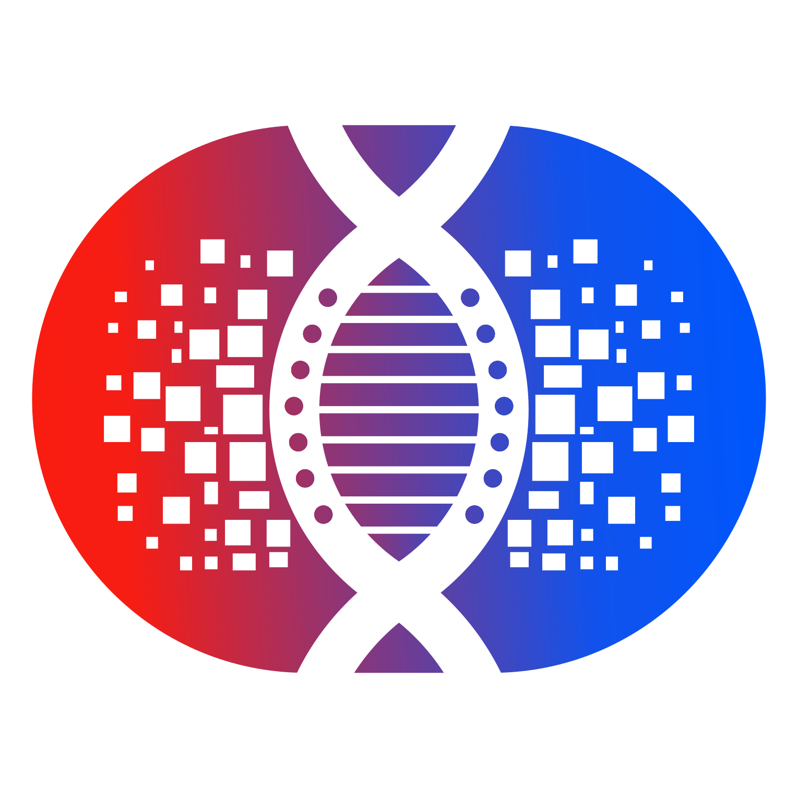

[](https://github.com/c3rb3ru5d3d53c/binlex/stargazers)
[](https://github.com/c3rb3ru5d3d53c/binlex/blob/master/LICENSE)


<table>
  <tr>
    <td style="border: none; text-align: center; vertical-align: middle;">
      
    </td>
    <td style="border: none; text-align: center; vertical-align: middle; padding-left: 10px;">
      <h1 style="font-weight: bold; margin: 0;">Binlex - A Binary Genetic Trait Lexer Framework</h1>
      <div style="font-size: smaller; font-weight: bold; margin-top: 5px;">
        <em>If maldevs think their binary is FUD, they're about to have an existential crisis.</em>
      </div>
    </td>
  </tr>
</table>

Binlex extracts instructions, basic blocks, and functions from binaries and emits searchable JSON traits for reverse engineering, hunting, and similarity workflows. It models binary structure with a genomics-inspired hierarchy: genomes (instructions, blocks, functions), chromosomes (wildcarded patterns), allele pairs (bytes), and genes (nibbles). That representation makes malware analysis and binary similarity more systematic by enabling pattern-level comparison, clustering, and signature generation across large sample sets.

## Features

- 🧬 Fast trait extraction for instructions, blocks, and functions
- 🔐 Hashing and traits: MinHash, TLSH, SHA256, entropy, and wildcard patterns
- 📈 Normalization and feature pipelines for ML-oriented similarity workflows
- 🧰 Interfaces: CLI, Rust API, Python API/bindings, and IDA plugin
- ⚙️ Processor framework in Rust with fast external execution over `ipc` and `http`
- 🧠 Build you own Rust processors to perform additional analysis
- 🎯 Tooling for YARA generation, symbol ingestion, and batch JSON workflows

## Supported Targets 🌐

- Platforms: Linux, macOS, Windows
- Formats: PE, ELF, Mach-O
- Architectures: AMD64, I386, CIL

## Included Command-Line Tool Suite 🧰

- `binlex`: main CLI for binary trait extraction
- `binlex-mcp`: Model Context Protocol server for exposing Binlex tools to MCP clients
- `binlex-server`: processor transport server for `http` workflows
- `binlex-hash`: hashing utility
- `binlex-image`: image-related utility
- `binlex-symbols`: symbol ingestion and conversion helper
- `binlex-yara`: generate YARA rules from Binlex-style patterns or streams

## Build & Install 🛠️

### Rust API & Tooling

```bash
cargo build --release --workspace
```

### Python Bindings 🐍

```bash
cd bindings/python/
virtualenv -p python3 venv/
source venv/bin/activate
pip install maturin[patchelf]
maturin develop
```

### Packaging 📦

```bash
make zst   # Arch Linux
make deb   # Debian-based
make wheel # Python Wheel
```

### IDA Plugin 🧠

```bash
cd plugins/ida/
pip install .
python -m binlex_ida install
```

### Docker Containers

```bash
# Local Build and Start
docker compose -f compose.yml -f compose.local.yml up --build -d
# Start Using Docker Hub
docker compose -f compose.yml -f compose.remote.yml up -d
```
### Documentation 📚

#### Guides

- [Command-Line Guide](docs/command-line.md)
- [Custom Processors](docs/processors.md)

#### Examples 🧪

- [Python Examples](examples/python/)
- [Rust Examples](examples/rust/)

#### Rust API

```bash
cargo doc --open
```
## Configuration 📁

Default configuration directories:
- Linux: `$XDG_CONFIG_HOME/binlex/binlex.toml` or `$HOME/.config/binlex/`
- macOS: `$HOME/Library/Application Support/binlex/`
- Windows: `%APPDATA%\binlex\`

## Citation 📖

If you use Binlex in a journal publication or an open-source AI model, cite:

```bibtex
@misc{binlex,
  author = {c3rb3ru5d3d53c},
  title = {binlex: A Binary Genetic Trait Lexer Framework},
  year = {2025},
  note = {Available at \url{https://github.com/c3rb3ru5d3d53c/binlex}}
}
```

For any other corporate/personal usage or generated outputs (for example YARA rules), citation is not required.
